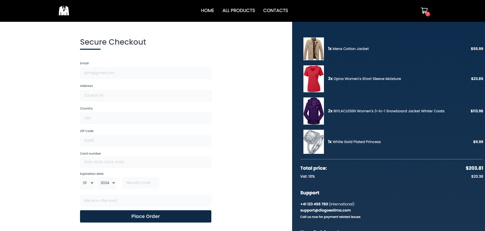

# 🛍️ E-commerce Product Gallery Frontend
[View Live Website](https://ecommerce-store-jade-gamma.vercel.app/)

## Project Overview
This project is an e-commerce web application built with React and Tailwind CSS. It allows users to browse products, add them to a cart, and complete a purchase. The application provides a smooth user experience with a responsive design and interactive features.

## Screenshots

### Home Page

The user is presented with the store landing page, featuring a hero section and highlighted products.

### All Products Page

The user can see all the products available in the store, filter by category, and sort by different criteria.

### Cart Page

The user can see all the items added to the cart. They can add or remove items from the cart, clear the cart, and proceed to checkout.

### Checkout Page

The user can add their payment information and shipping address. They also have access to all the purchase details before finalizing the order.

### Order Complete Page

The user can see the confirmation of a successful purchase, along with all the transaction details and the expected shipping time.

## Features

- **Product Listing**: Fetch and display a list of products from the Fake Store API. Each product shows an image, rating, name, price, an "Add to Cart" button and "View More" button.
- **Product Details**: Click on a product to see a more detailed view.
- **Shopping Cart**: Add products to the cart, view selected items, adjust quantities, and remove items.
- **Checkout Process**: Simple checkout form to enter mock payment and shipping information.
- **Search and Filter**: Search for products by name and filter by category, price, reviews, and purchases.
- **Responsive Design**: Engaging and responsive design that adapts well across devices.

## Getting Started

### Prerequisites

Ensure you have the following installed:
- Node.js
- npm (Node Package Manager)

### Installation

1. Clone the repository:

#### `git clone https://github.com/diogoestima1998/ecommerce-gallery.git`

2. Navigate to the project directory:

## Getting Started with Create React App

#### `cd ecommerce-gallery`

3. Install the dependencies:

#### `npm install`

4. Running the Application:

#### `npm start`

Runs the app in the development mode.\
Open [http://localhost:3000](http://localhost:3000) to view it in your browser.

The page will reload when you make changes.\
You may also see any lint errors in the console.

#### `npm test`

Launches the test runner in the interactive watch mode.\
See the section about [running tests](https://facebook.github.io/create-react-app/docs/running-tests) for more information.

#### `npm run build`

Builds the app for production to the `build` folder.\
It correctly bundles React in production mode and optimizes the build for the best performance.

The build is minified and the filenames include the hashes.\
Your app is ready to be deployed!

See the section about [deployment](https://facebook.github.io/create-react-app/docs/deployment) for more information.

#### `npm run eject`

**Note: this is a one-way operation. Once you `eject`, you can't go back!**

If you aren't satisfied with the build tool and configuration choices, you can `eject` at any time. This command will remove the single build dependency from your project.

Instead, it will copy all the configuration files and the transitive dependencies (webpack, Babel, ESLint, etc) right into your project so you have full control over them. All of the commands except `eject` will still work, but they will point to the copied scripts so you can tweak them. At this point you're on your own.

You don't have to ever use `eject`. The curated feature set is suitable for small and middle deployments, and you shouldn't feel obligated to use this feature. However, we understand that this tool wouldn't be useful if you couldn't customize it when you are ready for it.

**Architectural Overview**
This application follows a component-based architecture, leveraging React's declarative UI paradigm. The main components include:

Header: Navigation bar with links to different sections of the application.

Footer: Sticks to the bottom of the page, providing basic information and links.

Sidebar: Shows the shopping cart and allows users to manage their cart items.

Product: Displays individual product details in the product listing.

Pages: Separate pages for Home, All Products, Product Details, Checkout, and Order Complete.